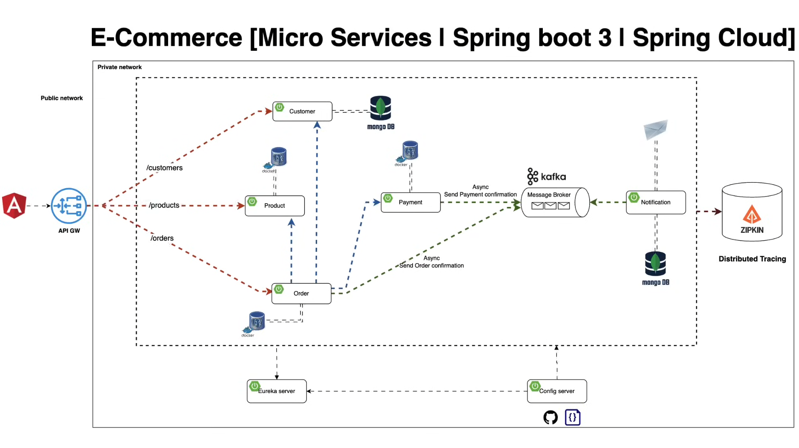

# [🚀 🔥 Mastering Microservices: Spring boot, Spring Cloud and Keycloak](https://www.youtube.com/watch?v=jdeSV0GRvwI)

Tomado del canal de youtube de **Bouali Ali**

En este proyecto exploraremos y participaremos en un progreso profundo en varios de los patrones distribuidos de
microservicios como:

- Servidores de configuración
- Servidor de descubrimiento (Eureka)
- Puerta de enlace API
- Comunicación asincrónica con Kafka.
- Comunicación sincrónica con Open Feign y Rest Templates
- Trazado distribuido con Zipkin y actuador de resorte
- Asegurar la aplicación con Keyclaok
- Configurar la infraestructura y las herramientas requeridas con Docker & Docker Compose

---

## Diseño global del sistema



## Definiendo dominios del sistema


## Configura infraestructura y herramientas

Vamos a apoyarnos de `Docker` y por supuesto de `docker compose` para crear 3 servicios. Estos servicios crearán los
contenedores para `postgres`, `mongodb` y `mail-dev`, de esta manera evitamos instalarlos en nuestra pc local.

````yml
services:
  postgres:
    image: postgres:15.2-alpine
    container_name: c-ms-postgres
    restart: unless-stopped
    environment:
      POSTGRES_USER: magadiflo
      POSTGRES_PASSWORD: magadiflo
    ports:
      - 5435:5432
    volumes:
      - postgres_data:/var/lib/postgresql/data
    networks:
      - ms-e-commerce-net

  mongodb:
    image: mongo:6-jammy
    container_name: c-ms-mongodb
    restart: unless-stopped
    environment:
      MONGO_INITDB_ROOT_USERNAME: magadiflo
      MONGO_INITDB_ROOT_PASSWORD: magadiflo
    ports:
      - 27017:27017
    volumes:
      - mongo_data:/data/db
    networks:
      - ms-e-commerce-net

  mail-dev:
    image: maildev/maildev
    container_name: c-ms-mail-dev
    restart: unless-stopped
    ports:
      - 1080:1080
      - 1025:1025
    networks:
      - ms-e-commerce-net

volumes:
  postgres_data:
    name: postgres_data
  mongo_data:
    name: mongo_data

networks:
  ms-e-commerce-net:
    name: ms-e-commerce-net
````

**IMPORTANTE**
> Para este proyecto usaremos una sola instancia del motor de base de datos de Postgres y dentro de él crearemos las
> distintas bases de datos para los distintos dominios de la aplicación. Esto lo hago para ahorrar recursos, dado que
> ejecutaremos distintos microservicios durante el desarrollo de este proyecto, de esa manera reduciremos el consumo
> de recursos. Por otro lado, si vamos a ir a un entorno de producción o si nuestra pc tiene los recursos suficientes
> `debemos asegurarnos de que cada microservicio tenga su propia instancia de motor de base de datos`, en otras
> palabras, cada microservicio debería apuntar a un contenedor único que esté ejecutando postgres sql y no tenerlo
> compartido como lo vamos a realizar en este proyecto.

**NOTA**
> En el tutorial original se han agregado dos servicios adicionales: `pg-admin` y `mongo-express`, pero en mi caso no
> lo he agregado, dado que usaré las aplicaciones que tengo instaladas en mi pc: `DBeaver` y `Studio 3T`.

Ejecutamos nuestro archivo `compose.yml` para crear los tres contenedores definidos:

````bash
M:\PROGRAMACION\DESARROLLO_JAVA_SPRING\02.youtube\18.bouali_ali\05.microservices\microservices-e-commerce (main -> origin)

$ docker compose up -d

[+] Running 6/6                      
 ✔ Network ms-e-commerce-net  Created
 ✔ Volume "postgres_data"     Created
 ✔ Volume "mongo_data"        Created
 ✔ Container c-ms-mongodb     Started
 ✔ Container c-ms-mail-dev    Started
 ✔ Container c-ms-postgres    Started
````

Finalmente, vemos que todos los contenedores se han creado y están ejecutándose correctamente:

````bash
$ docker container ls -a

CONTAINER ID   IMAGE                  COMMAND                  CREATED          STATUS                      PORTS                                            NAMES
ecf0143f041f   postgres:15.2-alpine   "docker-entrypoint.s…"   19 minutes ago   Up 19 minutes               0.0.0.0:5435->5432/tcp                           c-ms-postgres
18c8f8804e4d   maildev/maildev        "bin/maildev"            19 minutes ago   Up 19 minutes (unhealthy)   0.0.0.0:1025->1025/tcp, 0.0.0.0:1080->1080/tcp   c-ms-mail-dev
9b186bdc8b97   mongo:6-jammy          "docker-entrypoint.s…"   19 minutes ago   Up 19 minutes               0.0.0.0:27017->27017/tcp                         c-ms-mongodb
````

## Configura Kafka y Zookeeper con Docker

Si observamos el diagrama del "Diseño global del sistema" que mostramos al inicio veremos que estamos usando Kafka para
poder recibir mensajes y notificarlos. En ese sentido, vamos a agregar a nuestro archivo `compose.yml` el contenedor
de `Kafka` y al mismo tiempo agregaremos el contenedor de `Zookeeper`, dado que `Kafka` lo requiere para funcionar.

````yml
services:
  # other container services

  zookeeper:
    image: confluentinc/cp-zookeeper:7.4.0
    container_name: c-ms-zookeeper
    restart: unless-stopped
    environment:
      ZOOKEEPER_CLIENT_PORT: 2181
      ZOOKEEPER_TICK_TIME: 2000
    healthcheck:
      test: [ "CMD-SHELL", "nc -z localhost 2181 || exit 1" ]
      interval: 10s
      timeout: 5s
      retries: 5
    networks:
      - ms-e-commerce-net

  kafka:
    image: confluentinc/cp-kafka:7.4.0
    container_name: c-ms-kafka
    restart: unless-stopped
    environment:
      KAFKA_ZOOKEEPER_CONNECT: zookeeper:2181
      KAFKA_LISTENER_SECURITY_PROTOCOL_MAP: PLAINTEXT:PLAINTEXT,PLAINTEXT_HOST:PLAINTEXT
      KAFKA_ADVERTISED_LISTENERS: PLAINTEXT://localhost:9092
      KAFKA_OFFSETS_TOPIC_REPLICATION_FACTOR: 1
      KAFKA_TRANSACTION_STATE_LOG_MIN_ISR: 1
      KAFKA_TRANSACTION_STATE_LOG_REPLICATION_FACTOR: 1
    ports:
      - 9092:9092
    depends_on:
      zookeeper:
        condition: service_healthy
    networks:
      - ms-e-commerce-net

# other properties

networks:
  ms-e-commerce-net:
    name: ms-e-commerce-net
````

Notar que en el servicio de `zookeeper` estamos haciendo uso del checkeo de salud (`healthcheck`)  a través del comando
`test: [ "CMD-SHELL", "nc -z localhost 2181 || exit 1" ]`, donde:

- `nc`, es la abreviatura de Netcat, una utilidad de red que se usa para leer y escribir datos a través de conexiones de
  red utilizando los protocolos TCP o UDP.
- `-z`, esta opción le dice a Netcat que solo haga un escaneo de puertos, sin enviar ni recibir datos. Básicamente,
  verifica si el puerto especificado está abierto.
- `localhost`, es el nombre de host que representa la máquina local (es decir, la misma máquina donde se está ejecutando
  el comando). Se traduce a la dirección IP 127.0.0.1. En el caso del contenedor de zookeeper sería su interior.
- `2181`, es el número de puerto que se está verificando. En este caso, es el puerto en el que Zookeeper escucha por
  defecto.
- `test: ["CMD-SHELL", "nc -z localhost 2181 || exit 1"]`, utiliza el comando Netcat (nc) para verificar si el puerto
  2181 está abierto dentro del contenedor. Si el comando `nc -z localhost 2181` falla, se ejecuta `exit 1`, indicando un
  fallo en el healthcheck.

## Configura Zipkin con Docker

`Zipkin`, es un sistema de seguimiento distribuido. Ayuda a recopilar datos de tiempo necesarios para solucionar
problemas de latencia en arquitecturas de servicios. Las características incluyen tanto la recopilación como la
búsqueda de estos datos.

Trabajaremos con `Zipkin` mediante contendor de docker, para eso crearemos el servicio de zipkin en el archivo de
`compose.yml`.

````yml
services:
  zipkin:
    image: openzipkin/zipkin:3.4
    container_name: c-ms-zipkin
    ports:
      - 9411:9411
    networks:
      - ms-e-commerce-net
````

## Agrega dependencia de Zipkin a microservicios

Agregaremos las dependencias de `Zipkin`  a todos los microservicios que deseemos rastrear. En nuestro caso agregaremos
al `gateway-server` y a todos los microservicios de dominio: `customer`, `product`, `order`, `payment` y al
`notification` service.

````xml

<dependencies>
    <dependency>
        <groupId>org.springframework.boot</groupId>
        <artifactId>spring-boot-starter-actuator</artifactId>
    </dependency>
    <dependency>
        <groupId>io.micrometer</groupId>
        <artifactId>micrometer-tracing-bridge-brave</artifactId>
    </dependency>
    <dependency>
        <groupId>io.zipkin.reporter2</groupId>
        <artifactId>zipkin-reporter-brave</artifactId>
    </dependency>
</dependencies>

````

Al agregar la dependencia de `Zipkin` utilizando `Spring Initializr`, en automático nos agrega la dependencia
de `Actuator`, dado que Zipkin lo necesita para trabajar.

## Agrega configuración de Zipkin a los microservicios

A todos los microservicios que hemos agregado la dependencia de `Zipkin` le agregaremos las siguientes configuraciones
en su archivo `.yml` ubicado en el servidor de configuraciones.

````yml
management:
  tracing:
    sampling:
      probability: 1.0
````

El valor `1.0` indica que todas las solicitudes serán rastreadas.

Hay otra configuración que he usado en otros proyectos:
`management.zipkin.tracing.endpoint=http://localhost:9411/api/v2/spans`, aquí no lo uso porque, por defecto, zipkin
viene configurado con ese endpoint. Solo si el servidor de zipkin estuviera corriendo en otro puerto, allí sí debería
usar esa configuración para cambiar la url.

