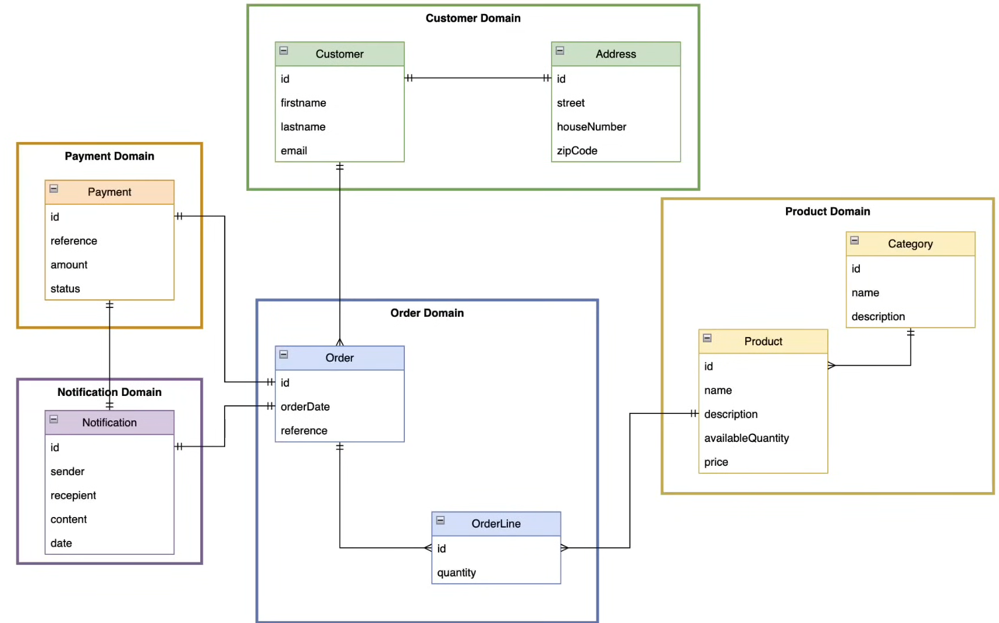

# [🚀 🔥 Mastering Microservices: Spring boot, Spring Cloud and Keycloak](https://www.youtube.com/watch?v=jdeSV0GRvwI)

Tomado del canal de youtube de **Bouali Ali**

En este proyecto exploraremos y participaremos en un progreso profundo en varios de los patrones distribuidos de
microservicios como:

- Servidores de configuración
- Servidor de descubrimiento (Eureka)
- Puerta de enlace API
- Comunicación asincrónica con Kafka.
- Comunicación sincrónica con Open Feign y Rest Templates
- Trazado distribuido con Zipkin y actuador de resorte
- Asegurar la aplicación con Keyclaok
- Configurar la infraestructura y las herramientas requeridas con Docker & Docker Compose

---

## Diseño global del sistema


## Definiendo dominios del sistema



## Configura infraestructura y herramientas

Vamos a apoyarnos de `Docker` y por supuesto de `docker compose` para crear 3 servicios. Estos servicios crearán los
contenedores para `postgres`, `mongodb` y `mail-dev`, de esta manera evitamos instalarlos en nuestra pc local.

````yml
services:
  postgres:
    image: postgres:15.2-alpine
    container_name: c-ms-postgres
    restart: unless-stopped
    environment:
      POSTGRES_USER: magadiflo
      POSTGRES_PASSWORD: magadiflo
    ports:
      - 5435:5432
    volumes:
      - postgres_data:/var/lib/postgresql/data
    networks:
      - ms-e-commerce-net

  mongodb:
    image: mongo:6-jammy
    container_name: c-ms-mongodb
    restart: unless-stopped
    environment:
      MONGO_INITDB_ROOT_USERNAME: magadiflo
      MONGO_INITDB_ROOT_PASSWORD: magadiflo
    ports:
      - 27017:27017
    volumes:
      - mongo_data:/data/db
    networks:
      - ms-e-commerce-net

  mail-dev:
    image: maildev/maildev
    container_name: c-ms-mail-dev
    restart: unless-stopped
    ports:
      - 1080:1080
      - 1025:1025
    networks:
      - ms-e-commerce-net

volumes:
  postgres_data:
    name: postgres_data
  mongo_data:
    name: mongo_data

networks:
  ms-e-commerce-net:
    name: ms-e-commerce-net
````

**NOTA**
> En el tutorial original se han agregado dos servicios adicionales: `pg-admin` y `mongo-express`, pero en mi caso no
> lo he agregado, dado que usaré las aplicaciones que tengo instaladas en mi pc: `DBeaver` y `Studio 3T`.

Ejecutamos nuestro archivo `compose.yml` para crear los tres contenedores definidos:

````bash
M:\PROGRAMACION\DESARROLLO_JAVA_SPRING\02.youtube\18.bouali_ali\05.microservices\microservices-e-commerce (main -> origin)

$ docker compose up -d

[+] Running 6/6                      
 ✔ Network ms-e-commerce-net  Created
 ✔ Volume "postgres_data"     Created
 ✔ Volume "mongo_data"        Created
 ✔ Container c-ms-mongodb     Started
 ✔ Container c-ms-mail-dev    Started
 ✔ Container c-ms-postgres    Started
````

Finalmente, vemos que todos los contenedores se han creado y están ejecutándose correctamente:

````bash
$ docker container ls -a

CONTAINER ID   IMAGE                  COMMAND                  CREATED          STATUS                      PORTS                                            NAMES
ecf0143f041f   postgres:15.2-alpine   "docker-entrypoint.s…"   19 minutes ago   Up 19 minutes               0.0.0.0:5435->5432/tcp                           c-ms-postgres
18c8f8804e4d   maildev/maildev        "bin/maildev"            19 minutes ago   Up 19 minutes (unhealthy)   0.0.0.0:1025->1025/tcp, 0.0.0.0:1080->1080/tcp   c-ms-mail-dev
9b186bdc8b97   mongo:6-jammy          "docker-entrypoint.s…"   19 minutes ago   Up 19 minutes               0.0.0.0:27017->27017/tcp                         c-ms-mongodb
````
