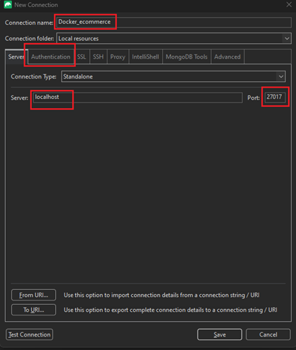
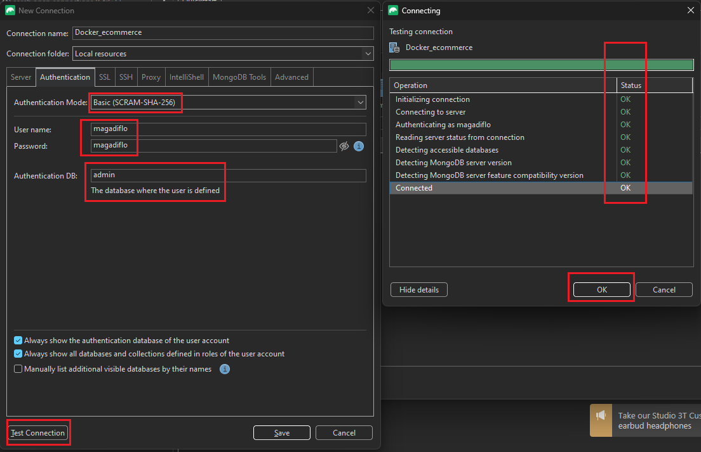
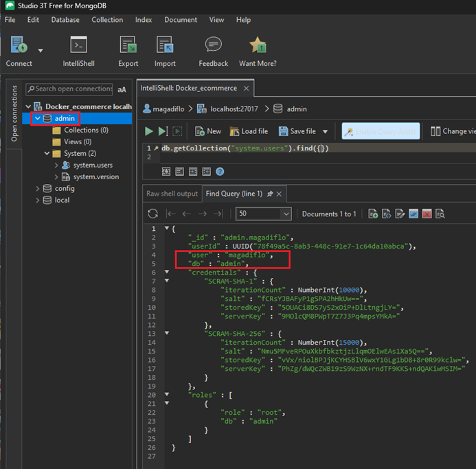

# Customer Microservice

**Referencias**

- [spring-microservices-in-action-2021](https://github.com/magadiflo/spring-microservices-in-action-2021/blob/main/06.on-service-discovery.md)

---

## Dependencias

````xml
<!--Spring Boot 3.3.1-->
<!--Java 21-->
<!--spring-cloud.version 2023.0.2-->
<dependencies>
    <dependency>
        <groupId>org.springframework.boot</groupId>
        <artifactId>spring-boot-starter-data-mongodb</artifactId>
    </dependency>
    <dependency>
        <groupId>org.springframework.boot</groupId>
        <artifactId>spring-boot-starter-validation</artifactId>
    </dependency>
    <dependency>
        <groupId>org.springframework.boot</groupId>
        <artifactId>spring-boot-starter-web</artifactId>
    </dependency>
    <dependency>
        <groupId>org.springframework.cloud</groupId>
        <artifactId>spring-cloud-starter-config</artifactId>
    </dependency>
    <dependency>
        <groupId>org.springframework.cloud</groupId>
        <artifactId>spring-cloud-starter-netflix-eureka-client</artifactId>
    </dependency>

    <dependency>
        <groupId>org.projectlombok</groupId>
        <artifactId>lombok</artifactId>
        <optional>true</optional>
    </dependency>
    <dependency>
        <groupId>org.springframework.boot</groupId>
        <artifactId>spring-boot-starter-test</artifactId>
        <scope>test</scope>
    </dependency>
</dependencies>
````

## Agrega propiedades de configuración

En el `application.yml` de este microservicio agregaremos el nombre del microservicio y la dirección para comunicarnos
con el servidor de configuraciones:

````yml
spring:
  application:
    name: customer-service
  config:
    import: optional:configserver:http://localhost:8888
````

Las otras configuraciones que tendrá este microservicio lo agregaremos al archivo de la siguiente ruta del servidor de
configuraciones:

`infrastructure/config-server/src/main/resources/config/customer-service.yml`

````yml
server:
  port: 8081
  error:
    include-message: always

spring:
  data:
    mongodb:
      host: localhost
      port: 27017
      database: db_customers
      username: magadiflo
      password: magadiflo
      authentication-database: admin

eureka:
  instance:
    prefer-ip-address: true
    instance-id: ${spring.application.name}:${vcap.application.instance_id:${spring.application.instance_id:${random.value}}}
  client:
    service-url:
      defaultZone: http://localhost:8761/eureka/
````

**IMPORTANTE**

La configuración `spring.data.mongodb.authentication-database=admin` es importante que lo tengamos definido, porque
sino, nos mostrará el siguiente stack de errores:

````bash
Caused by: com.mongodb.MongoSecurityException: 
Exception authenticating MongoCredential{mechanism=SCRAM-SHA-1, userName='magadiflo', source='db_customers', password=<hidden>, mechanismProperties=<hidden>}

Caused by: com.mongodb.MongoCommandException: 
Command failed with error 18 (AuthenticationFailed): 'Authentication failed.' on server localhost:27017. The full response is {"ok": 0.0, "errmsg": "Authentication failed.", "code": 18, "codeName": "AuthenticationFailed"}
````

La propiedad `authentication-database` en la configuración de MongoDB es importante cuando necesitas especificar la base
de datos que contiene las credenciales de usuario que se utilizarán para autenticarte. Por defecto, MongoDB utiliza la
base de datos `admin` para autenticar a los usuarios si no se especifica otra base de datos.

En nuestra configuración de `Docker Compose`, hemos especificado las credenciales `magadiflo` para el usuario
raíz de MongoDB `(MONGO_INITDB_ROOT_USERNAME)`, que típicamente se almacenan en la base de datos `admin`.
Aquí es donde entra la propiedad `authentication-database` en tu configuración de Spring Boot.

Esta configuración `sí es necesaria` porque le dice a Spring Boot que debe autenticar al usuario `magadiflo` utilizando
las credenciales almacenadas en la base de datos `admin`. Una vez autenticado, el usuario puede acceder a la base de
datos `db_customers` para realizar operaciones.

Si omitimos esta propiedad y las credenciales están en la base de datos `admin` (lo cual es común para las credenciales
de usuario raíz), podríamos encontrar problemas de autenticación, ya que Spring Boot intentaría autenticar al usuario en
la base de datos `db_customers` en lugar de la base de datos `admin`.

### Configura Studio 3T

Para interactuar con la base de datos de MongoDB utilizaremos `Studio 3T`. A continuación se muestra los pasos para
conectarnos a la base de datos de mongodb que se está ejecutando en docker.

Creamos una nueva conexión seleccionando la opción `Manually configure my connection settings`:



Luego, en la pestaña de `Authentication` agregamos las credenciales de conexión que están ubicadas en la base de datos
de autenticación `admin`.



Aprovechando que establecimos la conexión, podemos ingresar a la base de datos `admin` y ver que efectivamente nuestro
usuario `magadiflo` está registrado en dicha base de datos.



## Implementa customer service

Recordemos el diagrama que mostramos en la raíz de este proyecto, definimos el dominio `Customer` quien tiene incluído
las entidades de `Customer` y `Address`, por lo tanto, empezaremos definiendo dichas entidades:

````java

@ToString
@AllArgsConstructor
@NoArgsConstructor
@Builder
@Getter
@Setter
@Document(collection = "customers")
public class Customer {
    @Id
    private String id;
    private String firstName;
    private String lastName;
    private String email;
    private Address address;
}
````

````java

@ToString
@Builder
@AllArgsConstructor
@NoArgsConstructor
@Getter
@Setter
public class Address {
    private String street;
    private String houseNumber;
    private String zipCode;
}
````

Recordemos que estamos trabajando con `MongoDB` como base de datos `No Relacional`, donde:

- `@Document`, identifica un objeto de dominio que se conservará en `MongoDB`. Esta anotación se usa para definir una
  clase como un documento de `MongoDB`. En otras palabras, le dice a `Spring Data MongoDB` que esta clase debe mapearse
  a una colección en la base de datos `MongoDB`.
- `collection`, la colección en la que se supone que se almacena el documento que representa la entidad. Si no se
  configura, un nombre de colección predeterminado se derivará del nombre del tipo.

Así que, al usar `@Document(collection = "customers")`, estamos indicando que cada instancia de Customer se almacenará
como un documento en la colección `customers` de `MongoDB`.

Definimos el repositorio para el `Document` `Customer`:

````java
public interface CustomerRepository extends MongoRepository<Customer, String> {
}
````

Vamos a crear clases dto para enviar y recibir información:

````java
public record CustomerRequest(@NotBlank(message = "El primer nombre es requerido")
                              String firstName,

                              @NotBlank(message = "El apellido es requerido")
                              String lastName,

                              @NotBlank(message = "El correo es requerido")
                              @Email(message = "El correo no tiene un formato válido")
                              String email,

                              Address address) {
}
````

````java

@NoArgsConstructor
@AllArgsConstructor
@Builder
@Setter
@Getter
public class CustomerResponse {
    private String id;
    private String firstName;
    private String lastName;
    private String email;
    private Address address;
}
````

Ahora crearemos un mapper para poder mapear entidades a dto y dto a entidades:

````java

@Component
public class CustomerMapper {

    public Customer toCustomer(CustomerRequest request) {
        return Customer.builder()
                .firstName(request.firstName())
                .lastName(request.lastName())
                .email(request.email())
                .address(request.address())
                .build();
    }

    public CustomerResponse toCustomerResponse(Customer customerDB) {
        return CustomerResponse.builder()
                .id(customerDB.getId())
                .firstName(customerDB.getFirstName())
                .lastName(customerDB.getLastName())
                .email(customerDB.getEmail())
                .address(customerDB.getAddress())
                .build();
    }
}
````

Necesitamos crear una excepción personalizada, ya que lo usaremos en la clase de servicio:

````java
public class CustomerNotFoundException extends RuntimeException {
    public CustomerNotFoundException(String message) {
        super(message);
    }
}
````

También necesitamos crear una clase para manejar las excepciones:

````java
public record ErrorResponse(Map<String, String> errors) {
}
````

````java

@RestControllerAdvice
public class GlobalExceptionHandler {

    @ExceptionHandler(CustomerNotFoundException.class)
    public ResponseEntity<String> handle(CustomerNotFoundException exception) {
        return ResponseEntity
                .status(HttpStatus.NOT_FOUND)
                .body(exception.getMessage());
    }

    @ExceptionHandler(MethodArgumentNotValidException.class)
    public ResponseEntity<ErrorResponse> handle(MethodArgumentNotValidException exception) {
        var errors = new HashMap<String, String>();
        exception.getBindingResult().getAllErrors().forEach(error -> {
            String field = ((FieldError) error).getField();
            String defaultMessage = error.getDefaultMessage();
            errors.computeIfAbsent(field, fieldKey -> defaultMessage);
        });
        return ResponseEntity
                .status(HttpStatus.BAD_REQUEST)
                .body(new ErrorResponse(errors));
    }

}
````

Ya casi para acabar, necesitamos crear la clase de servicio donde implementaremos la lógica de negocio de la aplicación:

````java

@Slf4j
@RequiredArgsConstructor
@Service
public class CustomerService {

    private final CustomerRepository customerRepository;
    private final CustomerMapper customerMapper;

    public List<CustomerResponse> findAllCustomers() {
        return this.customerRepository.findAll().stream()
                .map(this.customerMapper::toCustomerResponse)
                .toList();
    }

    public CustomerResponse findCustomer(String customerId) {
        return this.customerRepository.findById(customerId)
                .map(this.customerMapper::toCustomerResponse)
                .orElseThrow(() -> new CustomerNotFoundException("No se encontró el cliente con id " + customerId));
    }

    public Boolean existsCustomer(String customerId) {
        return this.customerRepository.findById(customerId).isPresent();
    }

    public String createCustomer(CustomerRequest request) {
        Customer customer = this.customerMapper.toCustomer(request);
        return this.customerRepository.save(customer).getId();
    }

    public String updateCustomer(CustomerRequest request, String customerId) {
        return this.customerRepository.findById(customerId)
                .map(customerDB -> {
                    customerDB.setFirstName(request.firstName());
                    customerDB.setLastName(request.lastName());
                    customerDB.setEmail(request.email());
                    if (request.address() != null) {

                        Address addressDB = customerDB.getAddress();
                        if (addressDB == null) {
                            addressDB = Address.builder().build();
                        }

                        Address addressRequest = request.address();
                        if (addressRequest.getStreet() != null) {
                            addressDB.setStreet(addressRequest.getStreet().trim());
                        }

                        if (addressRequest.getHouseNumber() != null) {
                            addressDB.setHouseNumber(addressRequest.getHouseNumber().trim());
                        }

                        if (addressRequest.getZipCode() != null) {
                            addressDB.setZipCode(addressRequest.getZipCode().trim());
                        }

                        customerDB.setAddress(addressDB);
                    }
                    return customerDB;
                })
                .map(this.customerRepository::save)
                .map(Customer::getId)
                .orElseThrow(() -> new CustomerNotFoundException("Error en la actualización. Cliente con id " + customerId + " no encontrado"));
    }

    public void deleteCustomer(String customerId) {
        if (this.customerRepository.findById(customerId).isEmpty()) {
            throw new CustomerNotFoundException("Error al eliminar. Cliente con id " + customerId + " no encontrado");
        }
        this.customerRepository.deleteById(customerId);
    }
}
````

Finalmente, implementamos el controlador que llamará a la clase de servicio anterior:

````java

@RequiredArgsConstructor
@RestController
@RequestMapping(path = "/api/v1/customers")
public class CustomerController {

    private final CustomerService customerService;

    @GetMapping
    public ResponseEntity<List<CustomerResponse>> findAllCustomers() {
        return ResponseEntity.ok(this.customerService.findAllCustomers());
    }

    @GetMapping(path = "/{customerId}")
    public ResponseEntity<CustomerResponse> findCustomer(@PathVariable String customerId) {
        return ResponseEntity.ok(this.customerService.findCustomer(customerId));
    }

    @GetMapping(path = "/exists/{customerId}")
    public ResponseEntity<Boolean> existsCustomer(@PathVariable String customerId) {
        return ResponseEntity.ok(this.customerService.existsCustomer(customerId));
    }

    @PostMapping
    public ResponseEntity<String> createCustomer(@Valid @RequestBody CustomerRequest request) {
        return new ResponseEntity<>(this.customerService.createCustomer(request), HttpStatus.CREATED);
    }

    @PutMapping(path = "/{customerId}")
    public ResponseEntity<String> updateCustomer(@Valid @RequestBody CustomerRequest request, @PathVariable String customerId) {
        return ResponseEntity.ok(this.customerService.updateCustomer(request, customerId));
    }

    @DeleteMapping(path = "/{customerId}")
    public ResponseEntity<Void> deleteCustomer(@PathVariable String customerId) {
        this.customerService.deleteCustomer(customerId);
        return ResponseEntity.noContent().build();
    }

}
````
