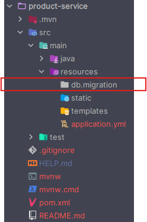
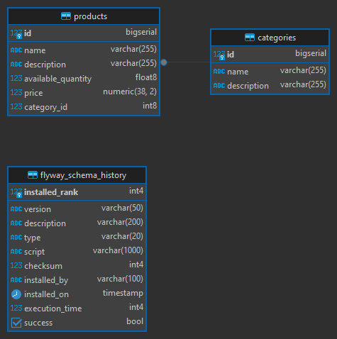
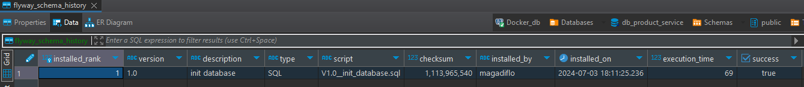

# Product Service

---

## Dependencias

````xml
<!--Spring Boot 3.3.1-->
<!--Java 21-->
<!--spring-cloud.version 2023.0.2-->
<dependencies>
    <dependency>
        <groupId>org.springframework.boot</groupId>
        <artifactId>spring-boot-starter-data-jpa</artifactId>
    </dependency>
    <dependency>
        <groupId>org.springframework.boot</groupId>
        <artifactId>spring-boot-starter-validation</artifactId>
    </dependency>
    <dependency>
        <groupId>org.springframework.boot</groupId>
        <artifactId>spring-boot-starter-web</artifactId>
    </dependency>
    <dependency>
        <groupId>org.flywaydb</groupId>
        <artifactId>flyway-core</artifactId>
    </dependency>
    <dependency>
        <groupId>org.flywaydb</groupId>
        <artifactId>flyway-database-postgresql</artifactId>
    </dependency>
    <dependency>
        <groupId>org.springframework.cloud</groupId>
        <artifactId>spring-cloud-starter-config</artifactId>
    </dependency>
    <dependency>
        <groupId>org.springframework.cloud</groupId>
        <artifactId>spring-cloud-starter-netflix-eureka-client</artifactId>
    </dependency>

    <dependency>
        <groupId>org.postgresql</groupId>
        <artifactId>postgresql</artifactId>
        <scope>runtime</scope>
    </dependency>
    <dependency>
        <groupId>org.projectlombok</groupId>
        <artifactId>lombok</artifactId>
        <optional>true</optional>
    </dependency>
    <dependency>
        <groupId>org.springframework.boot</groupId>
        <artifactId>spring-boot-starter-test</artifactId>
        <scope>test</scope>
    </dependency>
</dependencies>
````

Por defecto, cuando agregamos la dependencia de `Flyway` se crea en el directorio `/resources` el
directorio `/db/migration`, tal como se ve a continuación:



## Configura product service

Vamos a agregar las propiedades de configuración en el `application.yml` del `product service` y también crear un
archivo de configuración para este microservicio que será alojado en el servidor de configuración.

`business-domain/product-service/src/main/resources/application.yml`

````yml
spring:
  application:
    name: product-service
  config:
    import: optional:configserver:http://localhost:8888
````

Ahora, en el servidor de configuraciones creamos el siguiente archivo de configuración y agregamos las propiedades
restantes:

`infrastructure/config-server/src/main/resources/config/product-service.yml`

````yml
server:
  port: 8082
  error:
    include-message: always

spring:
  datasource:
    url: jdbc:postgresql://localhost:5435/db_product_service
    username: magadiflo
    password: magadiflo

  jpa:
    hibernate:
      ddl-auto: validate
    properties:
      hibernate:
        format_sql: true
  flyway:
    baseline-on-migrate: true
    enabled: true
    baseline-description: 'init'
    baseline-version: 0
    user: ${spring.datasource.username}
    password: ${spring.datasource.password}

eureka:
  instance:
    prefer-ip-address: true
    instance-id: ${spring.application.name}:${vcap.application.instance_id:${spring.application.instance_id:${random.value}}}
  client:
    service-url:
      defaultZone: http://localhost:8761/eureka/

logging:
  level:
    org.hibernate.SQL: DEBUG
````

**DONDE**

- `spring.jpa.hibernate.ddl-auto=validate`, la propiedad `spring.jpa.hibernate.ddl-auto` en una aplicación Spring Boot
  se utiliza para definir cómo hibernate debe manejar la creación y actualización de las tablas en la base de datos. El
  valor `validate` significa que Hibernate validará el esquema de la base de datos en comparación con las entidades
  mapeadas, pero no realizará ningún cambio en la base de datos. En nuestro caso,
  con `spring.jpa.hibernate.ddl-auto=validate`, hibernate comprobará que las tablas y columnas en tu base de datos
  coincidan con las entidades definidas en tu aplicación. Si hay alguna discrepancia, Hibernate lanzará una excepción,
  evitando que la aplicación se inicie. Esto es útil para asegurar que la base de datos está en el estado esperado sin
  realizar cambios automáticos.


- Al combinar la propiedad anterior con `Flayway` en el proyecto, `Flayway`  se encargará de manejar las migraciones de
  la base de datos, es decir, las actualizaciones de la estructura de la base de datos a lo largo del tiempo a través de
  scripts SQL predefinidos.


- `spring.flyway.baseline-on-migrate: true`, esta configuración indica a Flyway que debe aplicar una migración base si
  no hay una tabla de control de versiones de Flyway en la base de datos. La migración base se ejecuta la primera vez
  que Flyway se inicia en una base de datos.


- `spring.flyway.enabled: true`, esta propiedad habilita el uso de Flyway para manejar las migraciones de la base de
  datos en tu aplicación. Si se establece en `false`, Flyway no realizará ninguna migración al iniciar la aplicación.


- `spring.flyway.baseline-description: 'init'`, aquí se especifica la descripción que se utilizará para la migración
  base en caso de que se necesite ejecutar. Esta descripción es solo una etiqueta y no afecta el comportamiento de
  Flyway, pero puede ser útil para propósitos de documentación y claridad.


- `spring.flyway.baseline-version: 0`, indica la versión que se asignará a la migración base. En este caso, se establece
  en 0.


- `spring.flyway.user: ${spring.datasource.username}`, esta propiedad indica el usuario de la base de datos que Flyway
  utilizará para conectarse. En este caso, se hace referencia al nombre de usuario definido en las propiedades de
  configuración de la fuente de datos de Spring.


- `spring.flyway.password: ${spring.datasource.password}`, aquí se establece la contraseña del usuario de la base de
  datos que Flyway utilizará para conectarse. Al igual que con el usuario, se hace referencia a la contraseña definida
  en las propiedades de configuración de la fuente de datos de Spring.

## Crea las entidades Category y Product

Iniciamos creando nuestras dos entidades que estarán dentro de este microservicio. Establecemos la
relación `bidireccional` entre ambas entidades.

````java

@ToString
@AllArgsConstructor
@NoArgsConstructor
@Builder
@Getter
@Setter
@Entity
@Table(name = "categories")
public class Category {
    @Id
    @GeneratedValue(strategy = GenerationType.IDENTITY)
    private Long id;
    private String name;
    private String description;

    @OneToMany(mappedBy = "category", cascade = CascadeType.ALL, orphanRemoval = true)
    private List<Product> products;
}
````

````java

@ToString
@AllArgsConstructor
@NoArgsConstructor
@Builder
@Getter
@Setter
@Entity
@Table(name = "products")
public class Product {
    @Id
    @GeneratedValue(strategy = GenerationType.IDENTITY)
    private Long id;
    private String name;
    private String description;
    private Double availableQuantity;
    private BigDecimal price;

    @ManyToOne
    @JoinColumn(name = "category_id")
    private Category category;
}
````

## Crea fichero SQL para usar con Flyway

Ahora necesitamos crear el script sql donde definiremos las instrucciones para crear las tablas de la base de datos con
las que trabajaremos en este microservicio. Recordemos que estamos trabajando con `Flyway`, quien nos ayudará a ejecutar
nuestras migracionas. Por lo general, en proyectos anteriores, habíamos dejado que hibernate construya las tablas por
nosotros a partir de las entidades anotadas utilizando la propiedad de configuración `ddl-auto: update`
o `ddl-auto: create-drop`, etc., pero esta vez, lo crearemos manualmente y dejaremos que `Flyway` la ejecute
por nosotros.

Aún seguiremos usando la propiedad `ddl-auto` pero esta vez con el valor `validate`. Cuando iniciemos la aplicación,
Hibernate verificará que la estructura de la base de datos coincida exactamente con las definiciones de las entidades.
Cualquier discrepancia o error relacionado con la estructura de la base de datos se mostrará en los registros de la
aplicación.

Usar `spring.jpa.hibernate.ddl-auto=validate` es una buena práctica para entornos de producción donde deseas que
Hibernate solo valide la estructura existente de la base de datos sin realizar cambios automáticos. Esto ayuda a
prevenir modificaciones accidentales en la estructura de la base de datos y asegura que tu aplicación funcione
correctamente con la configuración de base de datos existente.

Entonces, definiremos las instrucciones de creación de las tablas en la siguiente ruta y archivo:

`business-domain/product-service/src/main/resources/db/migration/V1.0__init_database.sql`

````sql
CREATE TABLE IF NOT EXISTS categories(
    id BIGSERIAL PRIMARY KEY,
    name VARCHAR(255),
    description VARCHAR(255)
);

CREATE TABLE IF NOT EXISTS products(
    id BIGSERIAL PRIMARY KEY,
    name VARCHAR(255),
    description VARCHAR(255),
    available_quantity DOUBLE PRECISION NOT NULL,
    price NUMERIC(38,2),
    category_id BIGINT NOT NULL,
    CONSTRAINT fk_categories_products FOREIGN KEY(category_id) REFERENCES categories(id)
);
````

**IMPORTANTE**

> Para que `Flyway` pueda procesar los ficheros SQL es muy importante nombrar adecuadamente el fichero con la
> siguiente estructura de nombre:
>
> `V{número}__{nombre_del_archivo}.sql`, ojo que después del número son 2 guiones bajos (__).
>
> Por ejemplo:
>
> `V1.0__create_tables.sql`

## Ejecuta aplicación e inicia migración con Flyway

Una vez que tengamos configurado las propiedades de `Flyway` en el `product-service.yml` y creado nuestra primera
migración `V1.0__init_database.sql`, vamos a ejecutar la aplicación.

Al ejecutar la aplicación veremos en el log la siguiente información correspondiente a la ejecución de `flyway` y a la
migración del script que hemos creado.

````bash
org.flywaydb.core.FlywayExecutor         : Database: jdbc:postgresql://localhost:5435/db_product_service (PostgreSQL 15.2)
o.f.c.i.s.JdbcTableSchemaHistory         : Schema history table "public"."flyway_schema_history" does not exist yet
o.f.core.internal.command.DbValidate     : Successfully validated 1 migration (execution time 00:00.045s)
o.f.c.i.s.JdbcTableSchemaHistory         : Creating Schema History table "public"."flyway_schema_history" ...
o.f.core.internal.command.DbMigrate      : Current version of schema "public": << Empty Schema >>
o.f.core.internal.command.DbMigrate      : Migrating schema "public" to version "1.0 - init database"
o.f.core.internal.command.DbMigrate      : Successfully applied 1 migration to schema "public", now at version v1.0 (execution time 00:00.069s)
````

Si revisamos las tablas generadas, veremos las dos tablas definidas en la migración `V1.0__init_database.sql` y una
tercera tabla que nos crea el propio `Flyway` para que lleve el historial de ejecución de las migraciones.



Si revisamos los datos que contiene la tabla `flyway_schema_history` veremos que está el registro correspondiente a la
ejecución de la primera migración:



## Implementa Product Service

Empezaremos creando el repositorio para la entidad Product. Observemos que hemos creado un método utilizando
el `Query Method` de `Spring Data JPA`, es decir, palabras claves que nos ayudan a construir la consulta a través
del nombre del método y que por detrás Spring Data JPA se encargará de construir la consulta.

````java
public interface ProductRepository extends JpaRepository<Product, Long> {
    List<Product> findAllByIdInOrderById(List<Long> productIds);
}
````

A continuación crearemos un conjunto de DTOs que nos ayudarán a recibir datos o a exponerlos a través de endpoints:

````java
public record ProductRequest(@NotBlank(message = "El nombre del producto es requerido")
                             String name,

                             @NotBlank(message = "La descripción del producto es requerido")
                             String description,

                             @Positive(message = "La cantidad disponible debe ser positivo")
                             @NotNull(message = "La cantidad disponible no debe ser nulo")
                             Double availableQuantity,

                             @Positive(message = "El precio debe ser positivo")
                             @NotNull(message = "El precio no debe ser nulo")
                             BigDecimal price,

                             @NotNull(message = "La categoría del producto es requerido")
                             Long categoryId) {
}
````

````java
public record ProductPurchaseRequest(@NotNull(message = "El producto es obligatorio")
                                     Long productId,

                                     @Positive(message = "La cantidad debe ser positiva")
                                     @NotNull(message = "La cantidad es obligatorio")
                                     Double quantity) {
}
````

````java

@ToString
@AllArgsConstructor
@NoArgsConstructor
@Builder
@Getter
@Setter
public class ProductResponse {
    private Long id;
    private String name;
    private String description;
    private Double availableQuantity;
    private BigDecimal price;
    private Long categoryId;
    private String categoryName;
    private String categoryDescription;
}
````

````java

@ToString
@AllArgsConstructor
@NoArgsConstructor
@Builder
@Getter
@Setter
public class ProductPurchaseResponse {
    private Long productId;
    private String name;
    private String description;
    private BigDecimal price;
    private double quantity;
}
````

A continuación procedemos a crear los manejadores de excepciones:

````java

@RestControllerAdvice
public class GlobalExceptionHandler {

    @ExceptionHandler(EntityNotFoundException.class)
    public ResponseEntity<String> handle(EntityNotFoundException exception) {
        return ResponseEntity
                .status(HttpStatus.NOT_FOUND)
                .body(exception.getMessage());
    }

    @ExceptionHandler(ProductPurchaseException.class)
    public ResponseEntity<String> handle(ProductPurchaseException exception) {
        return ResponseEntity
                .status(HttpStatus.BAD_REQUEST)
                .body(exception.getMessage());
    }

    @ExceptionHandler(MethodArgumentNotValidException.class)
    public ResponseEntity<ErrorResponse> handle(MethodArgumentNotValidException exception) {
        var errors = new HashMap<String, String>();
        exception.getBindingResult().getAllErrors().forEach(error -> {
            String field = ((FieldError) error).getField();
            String defaultMessage = error.getDefaultMessage();
            errors.computeIfAbsent(field, fieldKey -> defaultMessage);
        });
        return ResponseEntity
                .status(HttpStatus.BAD_REQUEST)
                .body(new ErrorResponse(errors));
    }

}
````

````java
public record ErrorResponse(Map<String, String> errors) {
}
````

Observemos que la clase `GlobalExceptionHandler` está capturando la excepción personalizada `ProductPurchaseException`,
así que es necesario crearla.

````java
public class ProductPurchaseException extends RuntimeException {
    public ProductPurchaseException(String message) {
        super(message);
    }
}
````

Antes de pasar a la implementación del servicio de productos necesitamos crear una clase que mapeará nuestra entidad a
objetos dto y viceversa:

````java

@Component
public class ProductMapper {

    public Product toProduct(ProductRequest request) {
        return Product.builder()
                .name(request.name())
                .description(request.description())
                .availableQuantity(request.availableQuantity())
                .price(request.price())
                .category(Category.builder()
                        .id(request.categoryId())
                        .build())
                .build();
    }

    public ProductResponse toProductResponse(Product product) {
        return ProductResponse.builder()
                .id(product.getId())
                .name(product.getName())
                .description(product.getDescription())
                .availableQuantity(product.getAvailableQuantity())
                .price(product.getPrice())
                .categoryId(product.getCategory().getId())
                .categoryName(product.getCategory().getName())
                .categoryDescription(product.getCategory().getDescription())
                .build();
    }

    public ProductPurchaseResponse toProductPurchaseResponse(Product productDB, Double quantity) {
        return ProductPurchaseResponse.builder()
                .productId(productDB.getId())
                .name(productDB.getName())
                .description(productDB.getDescription())
                .price(productDB.getPrice())
                .quantity(quantity)
                .build();
    }
}
````

Ahora procedemos a crear nuestra clase de servicio con la implementación de la lógica de negocio:

````java
public interface ProductService {
    List<ProductResponse> findAllProducts();

    ProductResponse findProduct(Long productId);

    Long createProduct(ProductRequest request);

    List<ProductPurchaseResponse> purchaseProducts(List<ProductPurchaseRequest> request);
}
````

````java

@RequiredArgsConstructor
@Service
public class ProductServiceImpl implements ProductService {

    private final ProductRepository productRepository;
    private final ProductMapper productMapper;

    @Override
    @Transactional(readOnly = true)
    public List<ProductResponse> findAllProducts() {
        return this.productRepository.findAll().stream()
                .map(this.productMapper::toProductResponse)
                .toList();
    }

    @Override
    @Transactional(readOnly = true)
    public ProductResponse findProduct(Long productId) {
        return this.productRepository.findById(productId)
                .map(this.productMapper::toProductResponse)
                .orElseThrow(() -> new EntityNotFoundException("No se encontró el producto con id " + productId));
    }

    @Override
    @Transactional
    public Long createProduct(ProductRequest request) {
        Product product = this.productMapper.toProduct(request);
        return this.productRepository.save(product).getId();
    }

    @Override
    @Transactional
    public List<ProductPurchaseResponse> purchaseProducts(List<ProductPurchaseRequest> request) {
        // Obtenemos todos los id de los productos que se van a comprar
        List<Long> productIdsRequest = request.stream().map(ProductPurchaseRequest::productId).toList();

        // Verificamos si tenemos disponible todos los productos que se van a comprar
        List<Product> productsDB = this.productRepository.findAllByIdInOrderById(productIdsRequest);
        if (productIdsRequest.size() != productsDB.size()) {
            throw new ProductPurchaseException("Uno o varios productos no existen en la base de datos");
        }

        List<ProductPurchaseRequest> requestProductList = request.stream()
                .sorted(Comparator.comparing(ProductPurchaseRequest::productId))
                .toList();

        List<ProductPurchaseResponse> purchaseProducts = new ArrayList<>();

        for (int i = 0; i < productsDB.size(); i++) {
            Product productDB = productsDB.get(i);
            ProductPurchaseRequest productRequest = requestProductList.get(i);

            if (productDB.getAvailableQuantity() < productRequest.quantity()) {
                throw new ProductPurchaseException("Stock insuficiente para el producto con id " + productDB.getId());
            }

            double newAvailableQuantity = productDB.getAvailableQuantity() - productRequest.quantity();
            productDB.setAvailableQuantity(newAvailableQuantity);
            this.productRepository.save(productDB);

            purchaseProducts.add(this.productMapper.toProductPurchaseResponse(productDB, productRequest.quantity()));
        }

        return purchaseProducts;
    }
}
````

Para finalizar la implementación, creamos el controlador de productos donde expondremos los siguientes endpoints:

````java

@RequiredArgsConstructor
@RestController
@RequestMapping(path = "/api/v1/products")
public class ProductController {

    private final ProductService productService;

    @GetMapping
    public ResponseEntity<List<ProductResponse>> findAllProducts() {
        return ResponseEntity.ok(this.productService.findAllProducts());
    }

    @GetMapping(path = "/{productId}")
    public ResponseEntity<ProductResponse> findProduct(@PathVariable Long productId) {
        return ResponseEntity.ok(this.productService.findProduct(productId));
    }

    @PostMapping
    public ResponseEntity<Long> createProduct(@Valid @RequestBody ProductRequest request) {
        Long productId = this.productService.createProduct(request);
        URI productUri = URI.create("/api/v1/products/" + productId);
        return ResponseEntity.created(productUri).body(productId);
    }

    @PostMapping(path = "/purchase")
    public ResponseEntity<List<ProductPurchaseResponse>> purchaseProducts(@RequestBody List<ProductPurchaseRequest> request) {
        return ResponseEntity.ok(this.productService.purchaseProducts(request));
    }

}
````

## Agrega nueva migración: inserta datos

Vamos a crear una nueva migración tal como lo hicimos con la primera que nos permitió crear las tablas en la base de
datos. En esta oportunidad crearemos la migración para poblar las tablas creadas inicialmente. Para eso nos apoyaremos
de `Chat-GPT` para que nos cree registros aleatorios.

Recordar que el nombre del archivo debe seguir el formato `V{número}__{nombre_del_archivo}.sql`. Para esta nueva
migración crearemos el archivo `V2.0__insert_data.sql` que estará ubicado en
`business-domain/product-service/src/main/resources/db/migration/V2.0__insert_data.sql`.

````sql
INSERT INTO categories (name, description) VALUES
('Computadoras', 'Todo tipo de computadoras'),
('Laptops', 'Laptops de varias marcas'),
('Monitores', 'Monitores de diferentes tamaños y resoluciones'),
('Teclados', 'Teclados mecánicos y de membrana'),
('Mouse', 'Mouse para juegos y uso cotidiano'),
('Impresoras', 'Impresoras de tinta y láser'),
('Accesorios', 'Accesorios para computadoras'),
('Componentes', 'Componentes internos de computadoras'),
('Software', 'Software para productividad y juegos'),
('Redes', 'Equipos de redes y conectividad');

INSERT INTO products (name, description, available_quantity, price, category_id) VALUES
('Laptop Dell XPS 13', 'Laptop de alta gama de Dell', 50, 999.99, 2),
('Laptop HP Pavilion', 'Laptop para uso cotidiano', 100, 599.99, 2),
('Monitor Samsung 24"', 'Monitor Full HD de 24 pulgadas', 75, 149.99, 3),
('Monitor LG Ultrawide', 'Monitor Ultrawide para multitarea', 50, 299.99, 3),
('Teclado Mecánico Corsair', 'Teclado mecánico con retroiluminación RGB', 200, 129.99, 4),
('Teclado Logitech K120', 'Teclado básico para oficina', 300, 19.99, 4),
('Mouse Logitech G502', 'Mouse para juegos con alta precisión', 150, 49.99, 5),
('Mouse Microsoft Basic', 'Mouse básico para uso cotidiano', 250, 14.99, 5),
('Impresora HP LaserJet', 'Impresora láser monocromática', 50, 199.99, 6),
('Impresora Canon Pixma', 'Impresora de inyección de tinta a color', 80, 89.99, 6),
('Cable HDMI', 'Cable HDMI de alta velocidad', 500, 9.99, 7),
('Cargador de Laptop Universal', 'Cargador universal para laptops', 200, 29.99, 7),
('Procesador Intel i7', 'Procesador de alto rendimiento', 30, 299.99, 8),
('Tarjeta Gráfica NVIDIA GTX 1660', 'Tarjeta gráfica para juegos', 25, 229.99, 8),
('Software Microsoft Office', 'Suite de oficina de Microsoft', 100, 149.99, 9),
('Antivirus Norton', 'Software antivirus para protección', 200, 39.99, 9),
('Router TP-Link', 'Router inalámbrico de alta velocidad', 100, 49.99, 10),
('Switch Netgear', 'Switch de red de 8 puertos', 75, 29.99, 10),
('Laptop Lenovo ThinkPad', 'Laptop de negocios de Lenovo', 60, 899.99, 2),
('Monitor Acer 27"', 'Monitor de 27 pulgadas con resolución 4K', 40, 349.99, 3),
('Teclado Razer BlackWidow', 'Teclado mecánico para juegos', 100, 139.99, 4),
('Mouse Razer DeathAdder', 'Mouse para juegos con sensor óptico', 120, 59.99, 5),
('Impresora Epson EcoTank', 'Impresora de inyección de tinta con tanques recargables', 30, 249.99, 6),
('Auriculares Sony', 'Auriculares inalámbricos con cancelación de ruido', 150, 199.99, 7),
('Disco Duro Externo WD', 'Disco duro externo de 1TB', 200, 59.99, 7),
('Memoria RAM Corsair 16GB', 'Memoria RAM DDR4', 80, 79.99, 8),
('Placa Madre ASUS', 'Placa madre para procesadores Intel', 50, 129.99, 8),
('Sistema Operativo Windows 10', 'Sistema operativo de Microsoft', 150, 119.99, 9),
('Suite Adobe Creative Cloud', 'Suite de aplicaciones creativas de Adobe', 60, 239.99, 9),
('Extensor de Red TP-Link', 'Extensor de red inalámbrica', 100, 24.99, 10);
````
