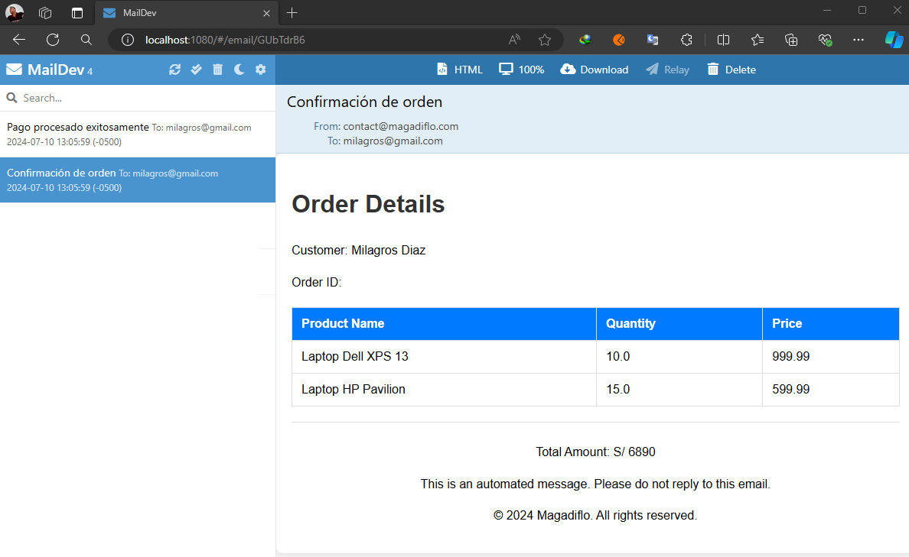

# Gateway Server

**Referencias**

- [spring-microservices-in-action-2021](https://github.com/magadiflo/spring-microservices-in-action-2021/blob/main/08.service-routing-with-spring-cloud-gateway.md)
- [ReactiveLoadBalancerClientFilter](https://docs.spring.io/spring-cloud-gateway/reference/spring-cloud-gateway/global-filters.html#reactive-loadbalancer-client-filter)

---

## Dependencias

````xml
<!--Java 21-->
<!--Spring Boot 3.3.1-->
<!--Spring Cloud Version 2023.0.2-->
<dependencies>
    <dependency>
        <groupId>org.springframework.cloud</groupId>
        <artifactId>spring-cloud-starter-config</artifactId>
    </dependency>
    <dependency>
        <groupId>org.springframework.cloud</groupId>
        <artifactId>spring-cloud-starter-gateway</artifactId>
    </dependency>
    <dependency>
        <groupId>org.springframework.cloud</groupId>
        <artifactId>spring-cloud-starter-netflix-eureka-client</artifactId>
    </dependency>

    <dependency>
        <groupId>org.springframework.boot</groupId>
        <artifactId>spring-boot-starter-test</artifactId>
        <scope>test</scope>
    </dependency>
    <dependency>
        <groupId>io.projectreactor</groupId>
        <artifactId>reactor-test</artifactId>
        <scope>test</scope>
    </dependency>
</dependencies>
````

## Agrega propiedades de configuración

En el `application.yml` del servidor Gateway agregamos la siguiente configuración:

````yml
spring:
  application:
    name: gateway-server
  config:
    import: optional:configserver:http://localhost:8888
````

En el servidor de configuraciones agregamos la configuración para el servidor gateway en el
archivo `gateway-server.yml`:

````yml
server:
  port: 8080
  error:
    include-message: always

spring:
  cloud:
    gateway:
      routes:
        - id: customer-service
          uri: lb://customer-service
          predicates:
            - Path=/api/v1/customers/**

        - id: product-service
          uri: lb://product-service
          predicates:
            - Path=/api/v1/products/**

        - id: order-service
          uri: lb://order-service
          predicates:
            - Path=/api/v1/orders/**

        - id: order-line-service
          uri: lb://order-service
          predicates:
            - Path=/api/v1/order-lines/**

        - id: payment-service
          uri: lb://payment-service
          predicates:
            - Path=/api/v1/payments/**

eureka:
  instance:
    prefer-ip-address: true
    instance-id: ${spring.application.name}:${vcap.application.instance_id:${spring.application.instance_id:${random.value}}}
  client:
    service-url:
      defaultZone: http://localhost:8761/eureka/
````

Si la URL tiene un esquema `lb` (como `lb://customer-service`), utiliza el `Spring Cloud ReactorLoadBalancer` para
resolver el nombre (`customer-service` en este ejemplo) a un host y puerto reales y reemplaza el URI en el mismo
atributo. La URL original no modificada se añade a la lista en el
atributo `ServerWebExchangeUtils.GATEWAY_ORIGINAL_REQUEST_URL_ATTR`.

Hasta este punto hemos finalizado la implementación del `Gateway Server`, es decir, podríamos levantar toda la
aplicación y utilizar el servidor gateway como único punto de entrada para las peticiones y debería funcionar
correctamente.

---

# Configurando microservicios para aplicar Load Balancer

---


Para que nuestros microservicios puedan escalar horizontalmente, es decir, se puedan crear múltiples instancias de
ellos, necesitamos trabajar con balanceo de carga. Observar que en el archivo `gateway-server.yml`, nuestro servidor
`Gateway Server` está trabajando con `Load Balancer` a través del esquema `lb`.

Ahora, si revisamos el diagrama general de nuestra aplicación ubicada en el `README.md` principal veremos que el
microservicio `order-service` hace llamadas internas hacia los microservicios `customer-service`, `product-service` y
`payment-service`. Para que esas llamadas puedan realizarse utilizando `Load Balancer` debemos hacer una pequeña
modificación en la generación del bean del `RestClient`, así como modificar los puertos de los microservicios.

## Order-service: Agrega anotación @LoadBalanced

````java

@Configuration
public class AppConfig {
    @Bean
    @LoadBalanced
    RestClient.Builder restClientBuilder() {
        return RestClient.builder();
    }
}
````

El `@LoadBalanced` es una anotación para marcar `RestTemplate`, `RestClient.Builder` o `WebClient`. El Builder bean se
configurará para utilizar un `LoadBalancerClient`.

## Order-service: Modifica FeignClient

En nuestro microservicio `order-service` estamos haciendo uso de dos clientes http `FeingClient` y `RestClient`. Con
respecto a este último, vimos en el apartado anterior la modificación realizada.

Con respecto al uso de `@FeignClient`, dejaremos únicamente los dos atributos `name` y `path`. En este caso, como
estamos trabajando con `Spring Cloud Load Balancer`, la anotación `@FeignClient` utilizará el load balance a las
solicitudes el backend. El load balanced se puede configurar utilizando el mismo nombre, en nuestro caso estamos
usando el nombre del microservicio al que queremos llamar `customer-service`. Este nombre está definido en la
configuración `custom.config.customer.name` en el archivo de configuración `order-service.yml`.

````java

@FeignClient(name = "${custom.config.customer.name}", path = "${custom.config.customer.path}")
public interface CustomerClient {
    @GetMapping(path = "/{customerId}")
    Optional<CustomerResponse> findCustomer(@PathVariable String customerId);
}
````

## Config-server: Define puertos dinámicos en archivos de configuración

Recordemos que en el microservicio `config-server` tenemos definidos los archivos de configuración de todos nuestros
microservicios. Vamos a modificar los siguientes microservicios con el puerto en cero (0), eso indica que el puerto
se deberá generar de manera aleatoria.

Los archivos de configuración de los microservicios a modificar son: `customer-service.yml`, `notification-service.yml`,
`order-service.yml`, `payment-service.yml` y `product-service.yml`. Cada uno de esos archivos deberá modificar el
puerto con valor en cero, de la siguiente manera:

````yml
server:
  port: 0
````

Con respecto al archivo de configuración del microservicio de order `order-service.yml`, debemos no solo agregar el
puerto en cero, sino que modificar las rutas de los microservicios a llamar:

````yml
server:
  port: 0

custom:
  config:
    customer:
      name: customer-service
      path: /api/v1/customers
    product:
      url: http://product-service
      path: /api/v1/products
    payment:
      url: http://payment-service
      path: /api/v1/payments
````

Notar que en la configuración `custom.config.customer.name` estamos usando el nombre del microservicio a consumir. Aquí
hemos definido a criterio propio el `name`, dado que el valor de esta configuración será usada por el cliente
`FeignClient`. Mientras que las configuraciones de `product` y `payment` los dejamos con `url`, también a criterio
propio, porque estas configuraciones están siendo usadas por `RestClient`.

Notar que ya no usamos `localhost` con el puerto, dado que estmos trabajando con un servidor de descubrimiento como
`Eureka Server`, aquí únicamente usamos el nombre de los microservicios con quienes nos vamos a comunicar.

**Importante**
> Un punto importante en este apartado es que en las configuraciones de `url` que están siendo usadas por el cliente
> `RestClient` debemos usar el `http://` como prefijo, dado que si no lo usamos, es decir, colocamos únicamente el
> nombre del microservicio a consumir, al momento de hacer la llamada nos va a mostrar un mensaje de error, que
> no encuentra la ruta especificada.

## Probando flujo completo de la aplicación

Para realizar las pruebas levantamos todos nuestros microservicios. Tres microservicios levantaremos con más de una
instancia.

- `Customer-service`: 2 instancias
- `Product-service`: 3 instancias
- `Payment-service`: 2 instancias

El orden para levantar los microservicios será el siguiente:

1. Config Server
2. Discovery Server
3. Business domain (no importa el orden): customer, product, order, payment, notification
4. Gateway Server

## 1° Orden de compra

````bash
$ curl -v -X POST -H "Content-Type: application/json" -d "{\"amount\": 6890, \"paymentMethod\": \"CREDIT_CARD\", \"customerId\": \"668ecb2b7855023d09047b82\", \"products\": [{\"productId\": 1, \"quantity\": 10}, {\"productId\": 2, \"quantity\": 15}]}" http://localhost:8080/api/v1/orders
>
* upload completely sent off: 172 bytes
< HTTP/1.1 201 Created
< transfer-encoding: chunked
< Location: /api/v1/orders/2
< Content-Type: application/json
< Date: Wed, 10 Jul 2024 18:05:58 GMT
<
2
````

Luego de realizar una solicitud de orden, veamos qué instancias se han ejecutado, para eso nos guiaremos de los puertos
que se han usado.

- `Customer-service`: 54889
- `Product-service`: 55022
- `Payment-service`: 55089

Si revisamos el servidor de correo, veremos que nos han llevado dos correos: confirmación de la orden y la confirmación
del pago.



## 2° Orden de compra

````bash
$ curl -v -X POST -H "Content-Type: application/json" -d "{\"amount\": 2560, \"paymentMethod\": \"CREDIT_CARD\", \"customerId\": \"668ecb2b7855023d09047b82\", \"products\": [{\"productId\": 4, \"quantity\": 16}, {\"productId\": 3, \"quantity\": 4}]}" http://localhost:8080/api/v1/orders
* upload completely sent off: 171 bytes
< HTTP/1.1 201 Created
< transfer-encoding: chunked
< Location: /api/v1/orders/3
< Content-Type: application/json
< Date: Wed, 10 Jul 2024 18:12:32 GMT
<
3
````

Puertos utilizados por las llamadas internas a través del balanceo de carga:

- `Customer-service`: 54901
- `Product-service`: 54996
- `Payment-service`: 55067

Como observamos, al realizar una nueva petición, las instancias a las que se llaman son otras. De esta manera estamos
comprobando que se está aplicando el balanceo de carga correctamente.

Finalmente, si revisamos el servidor de correo veremos que nos habrá llegado los dos correos similares al anterior.

